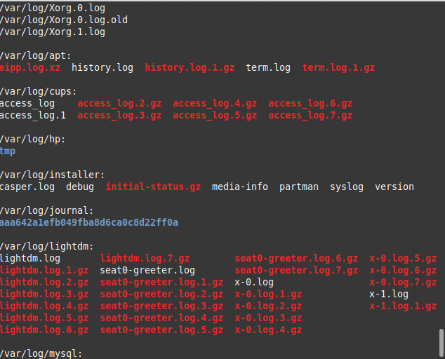
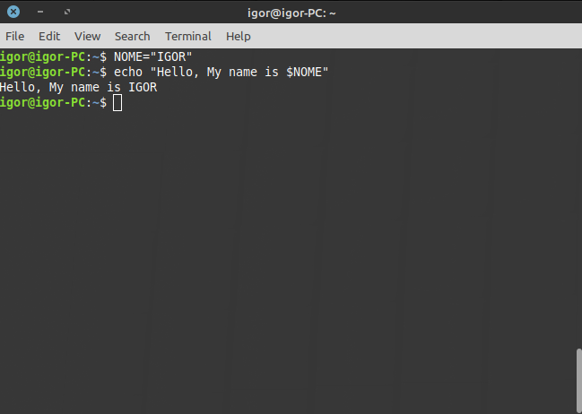
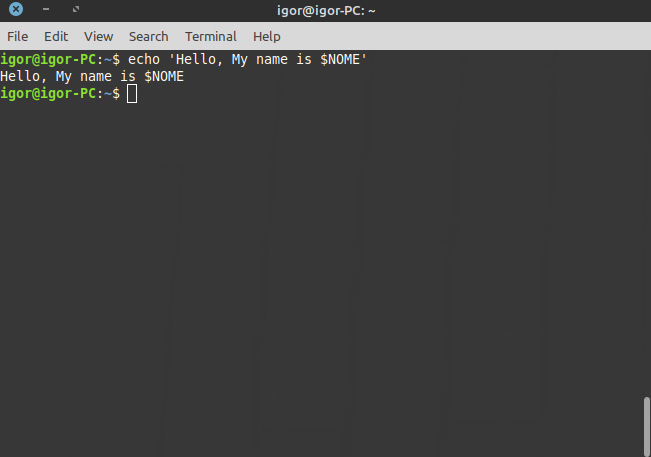
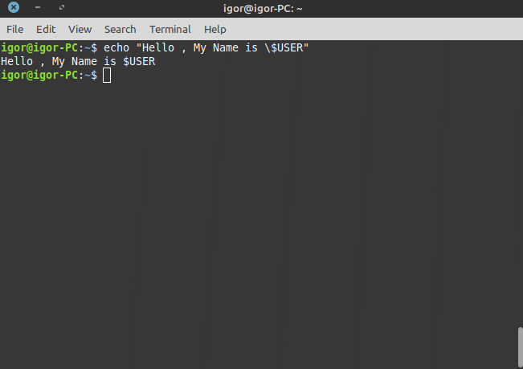

# Linux Essential

Arquivo para armazenar as anotações sobre conteúdos para a prova "Linux Essential"

## Free Software & Open Source

### Open source

Algum software open source é basicamente quando o **código** é livre, aberto para qualquer um.

Quem "fundou" : **OSI**

### Free Software

Se trata mais para o lado sentimental do usuário do que a parte de código.

### FOSS / FLOSS

Junção de Free Software com Software Open Source

FOSS : Free and Open Source Software
FLOSS : Free/Libre and Open Source Software

### Como as empresas Open Source lucram?

Através de doações, de propagandas ou até por venda de recursos / suporte (Redhat)

Exemplo simples: **Mozilla Firefox** recebe de empresas para que a marca seja colocada na página principal do navegador...

## Licenças

## Copyleft

Uma pessoa não pode pegar meu código (clonar), modificar e aplicar alguma outra licença em cima dele, ou fazê-lo como código fechado, muito menos vendê-lo.

Ex: GPLv2 , GPLv3, LGPL..

GPLv3 corrige as falhas da v2

## Permissive

A pessoa pode fazer qualquer coisa com o código, vender, trocar para outra licença (GPL ...)

## Creative commons (CC)

Licença geral , global. Utilizado muito no Youtube. 

Basicamente, a pessoa pode pegar o conteúdo e replicá-lo, exemplo: Um vídeo no Youtube. Um usuário pode baixar o vídeo e redistribuir, compartilhar. 

# Commercial, Shareware, Freeware

## Commercial

Softwares pagos, licenças..

## Shareware Software

Junção do Freeware com Commercial, exemplo: Peço um acesso prévio do sistema durante X período e após isso é necessário pagar.

## Freeware Software

Basicamente, é um software gratuito.

# Distruibuições

Basicamente, pegam o kernel linux e modificam em cima do kernel, e existem distribuições específicas para cada uso: Servidor, usuário final...

## Linux

Composto por:

* Kernel
* Gnu Core Utils (Pacotão de pacotes)
* Softwares supl. (Interface..)
* Scripts/Serviços 
* Instaladores

Algumass **principais** distribuições:

* Debian -> Ubuntu, Mint
* Red Hat -> CentOS -> Scientific (Trabalhar com análise de dados, baseado no RedHat)
* Slackware -> Suse -> OpenSuse

Versão estável: Quando a distro é **LTS** (Long Term Support), ou seja, tem um suporte por dois anos...

## Sistemas embarcados

Quando o S.O já vem instalado no hardware e normalmente é difícil retirá-lo de forma oficial, por exemplo : **Android**

## Cloud computing

Servidores em nuvem. Exemplos:

* AWS
* Google Cloud
* OpenStack (Servidor em nuvem **privada**)

# FHS (File System Hierarchy)

Tudo está dentro de "/" , ou seja, todo o sistema operacional, a raiz.

Diretórios:

* **/bin** : arquivos executáveis, binários...
* **/boot** : arquivos para o carregamento do sistema, do boot, dos drivers..
* **/dev** : aonde é localizado **TODOS** os dispositivos, exemplo: Hd, Pendrive, Mouse..
* **/etc** : arquivos de configurações de serviços
* **/home**: onde é localizados os usuários do sistema
* **/lib** : ".so" , são bibliotecas que softwares usam
* **/lib64** : ".so", são bibliotecas que softwares usam
* **/media**: onde é localizado dispositivos que são montados automaticamente
* **/mnt** : parecido com /media, porém ele é usado como montagem temporária
* **/opt** : "optional", pacotes instalados externamentes
* **/proc** : "pseudo-sistema de arquivos", armazena informações sobre o hardware
* **/root** : /home do usuário root
* **/run** : arquivos temporários
* **/sbin** : comandos sobre recuperação de sistema executados **somente** pelo root 
* **/sys** : Informações de drivers, módulos..
* **/usr** : tudo que é relacionado ao usuário, programas específicos para o usuário
* **/var** : arquivos de logs, arquivos variáveis

# Aplicações Open Source

*Aplicações Desktop / Usuários*

* OpenOffice
* Thunderbird
* Firefox
* LibreOffice (Fork do OpenOffice)
* GIMP
* Blender
* Banshee
* Links

*Aplicações para Servidor*

* Apache / Nginx
* Mysql / MariaDB
* Samba
* Telnet

# Linguagens de programação e métodos de desenvolvimento

Estilos de desenvolvimento: **Catheral** e **Bazaar**

### Cathedral

Estilo de desenvolvimento Cathedral é um estilo de dev. fechado. O código fonte é disponibilizado a cada release de software.

### Bazaar

Estilo de desenvolvimento Bazaar é totalmente aberto e público. O criador deste método foi o próprio Linus Torvalds.

## Linguagens compiladas

Código ao qual é necessário ser compilado para ser executado

Linguagens que necessitam ser compiladas:

* C
* Go
* Haskell

## Linguagens interpretadas

Não é necessário gerar um novo arquivo, só é preciso escrever. Ele irá ler em tempo real e nos gerar uma saída.

Linguagens que são interpretadas:

* Python
* Java
* Php
* Shell Script
* Perl

# Gerenciador de pacotes .deb e .rpm

## .deb(apt)

**/etc/apt/sources.list**

Pacotes .deb são para debian e derivados.

> Para instalar:

``sudo apt-get install packet``

> Para remover:

``sudo apt-get remove packet``

> Para remover o pacote + configurações + pacotes não utilizados mais pelo software:

``sudo apt-get remove --purge packet``

> Para procurar por pacotes:

``sudo apt-cache search packet``

> Para atualizar:

``sudo apt update``

> Para atualizar as versões dos softwares:

``sudo apt-get upgrade``

> Para instalar as dependências (armazenadas no cache):

``sudo apt -f install``

> O "apt", na verdade executa o "dpkg" no fundo dos panos.

> Para instalar um pacote .deb:

``sudo dpkg -i packet``

> Para remover um pacote .deb:

``sudo dpkg --remove packet``

> Para procurar softwares:

``sudo dpkg -l | grep packet``

## .rpm (yum/dnf)

**/etc/yum.repos.d/**

> Para instalar:

``sudo dnf install packet``

> Verifica se há alguma atualização para X pacote:

``yum check-update httpd``

> Verifica as dependências para X pacote:

``yum deplist httpd``

> Para remover:

``sudo dnf remove packet``

> Para remover os pacotes obsoletos:

``yum clean packages``

> Para atualizar o repositório:

**O yum é diferente do apt, já que ele ATUALIZA o repositório e o SISTEMA**

``yum update``

> Para pesquisar por pacotes (cache):

``yum search firefox``

> Para remover o pacote + configurações + pacotes não utilizados mais pelo software:

``yum remove --purge packet``

> Para procurar por pacote + informações sobre:

``rpm -qi nano``

> Para procurar documentações do pacote:

``rpm -qd nano``

> Para procurar por arquivos de configs do pacote:

``rpm -qc nano``

> Visualizar todas libraries que o programa está usando / depende:

``rpm -qR nano``

> Para instalar um pacote .rpm :

``rpm -ihv nano.tpm``

> Procurar programas:

``rpm -qa | grep nano``

> Para remover por rpm:

``rpm -e nano``

# SHELL

O shell recebe dados do terminal, processa e retorna algo de volta para o terminal.

**Usuário** -> **Shell** -> **SO** -> **Kernel**

Existem alguns tipos de shell, entre eles:

* Bash (Padrão)
* Zsh
* Csh
* Tcsh

Cada usuário possui o tipo de shell padrão definido no arquivo */etc/passwd*

# Variável PATH e Echo

O comando echo escreve alguma string na tela, exemplo:

> Mostra a variável PATH

``echo $PATH``

> Mostra a variável PATH sem quebra de linha

``echo -n $PATH``

## O que é a variável PATH ?

* São diretórios onde o usuário procura determinado binário, exemplo: Ao executar o comando ``ls`` ele verifica em todos os diretórios do comando path procurando por ls, se achar ele executa, se não mostra erro.

## Ver o nome do usuário

* whoami
* echo $USER
* echo $LOGNAME

# Runlevel

Numeração específica do **estado** do sistema.

Exemplos:

* runlevel 0 : Diz que o equipamento vai desligar
    * *poweroff*
    * *shutdown*
    * *halt*
* runlevel 3 : Multi usuário no CLI
* runlevel 5 : Multi usuário com interface gráfica
* runlevel 6 : Reiniciar o equipamento
    * *shutdown -r*
    * *reboot*

Para saber qual runlevel estou: ``runlevel``

# Informações do sistema

``uname`` : Nome do kernel

``uname -r``: Versão do kernel utilizado no momento

``uname -v``: Data da build do kernel

``uname -p``: Arquitetura do sistema (x32,x64)

``uname -o``: Qual sistema está utilizando

``uname -a``: Mostra tudo

# Scripts de inicialização

Existem tipos de shell's :

* Shell login: Login realizado no sistema. Inserindo usuário e senha.

* Shell non login: Normalmente utilizado em scripts. **Não** necessário passar a senha e usuário, exemplos:

    * Ao logar-se em ambiente desktop e posteriormente abrir um terminal gráfico, é um non login.

    * Scripts automatizados (Cron, Rsync...)

* Shell interativo : Quando é interagido manualmente, **interagindo**. Quando eu recebo STDOUT ou STDERR como retorno de alguma inserção de dados. 

* Shell não interativo : Quando não é necessário interagir manualmente, inserindo dados. Scripts utilizam esse tipo.

Exemplo: **Shell não interativo non login** = Execução de algum script / script diário/semanal/mensal..

Os scripts de inicialização são diferentes em cada um.

## Shell non login

1. ~/.bashrc
2. bashrc chama /etc/bash.bashrc *ou* /etc/bashrc
3. /etc/bashrc chama e executa todos scripts de /etc/profile.d/*

## Shell de login

**/etc/profile**

1. **~/.bash_profile** : Caso não encontre ele procura o passo 2

2. **~/.bash_login** : Caso não encontre ele procura o passo 3

3. **~/.profile** 

## Ordem de inicialização de scripts

> Para shell não interativo

1. É executado o arquivo "/etc/profile" (**Executado em interativo e não interativo**)
2. É executado o "~/.bashrc"

# Variáveis

Existem dois tipos de variáveis:

* Globais : Transforma as variáveis locais em globais , com o comando **export**. **env** para ver as variáveis ambiente (globais)

* Locais : **set**, aplicáveis apenas na sessão do bash

Exemplo:

``export PATH=$PATH:/opt``

# File Globbing

* Asterístico : Tudo
* Interrogação: Apenas um
* Lista de dígitos : Caracteres válidos na busca, utiliza-se **[]**

Exemplo: Padrão para o arquivo **weatherreport1996-2017.csv**

``ls [wW]eather[rR]eport199[0-9]?201[0-9]*.csv``

Asterístico não serve apenas para file globbing, também para:

``ls /var/log/*``

> Saída:

# Aspas

## Aspas duplas

Shell interpreta os comandos especiais, exemplo:

## Aspas simples

Shell interpeta de modo LITERAL , exemplo:

## Deixando a string em modo literal

> Coloca-se contrabarra (\\) antes do caractere especial 

# Detalhamento shell

Composto por: **nome**@**hostname**:**diretório**$ / #

Hostname definido em */etc/hostname*

Novo método para trocar hostname: **hostnamectl set-hostname <hostname>**

# Encontrar arquivos

* **locate**: Realiza busca através de cache , para atualizar o cache é necessário atualizar o banco, 

    * sudo updatedb 

* **find** [diretorio] [argumentos]

    * find / -name "findme.txt"
    * find / -iname "FINDME.txt"
    
        * O parâmetro "-iname" é case-sensitive, o -name não.

# Manuais & Documentações

**man** [parâmetro]

---

O manual é dividido por seções, para padronizar os manuais dos softwares do sistema linux, são divididos em:

1. Comandos shell ou executáveis
2. System calls (chamadas de sistemas)
3. Chamadas de bibliotecas
4. Arquivos especiais (normalmente em /dev)
5. Formatos de arquivos e convenções (ex: /etc/passwd)
6. Jogos
7. Miscelânia
8. Comandos de administração de sistemas
9. Rotinas do kernel

Exemplo: 

* man -k tty  **OU** apropos tty

    * Busca por palavra-chave contendo na descrição ou nome

* man -f tty  **OU** whatis tty

    * Busca *exatamante* o nome , não que contenha na descrição de outros...

## Acessando X página do manual

``man 5 passwd``

``man 4 tty``

---

## Info

O comando info é para ver documentações , porém seu diferencial é para abrir *hyperlinks* 

# Referência

* [Curso preparatório de Mateus Miller](https://www.udemy.com/course/lpi-linux-essentials)

* Documentação própria do sistema (*man* / *info*)